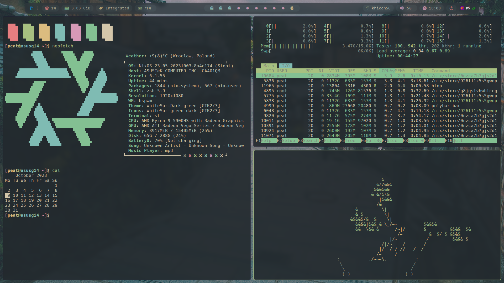

#NixOS dotfiles
These are my configuration files and NixOS configuration

**STUFF THAT I USE**:

- **OS**: [NixOS 23.05 (stable)](https://nixos.org/)
- **WM**: [BSPWM](https://github.com/baskerville/bspwm)
- **Terminal**: [st (siduck fork)](https://github.com/siduck/st) / [kitty](https://sw.kovidgoyal.net/kitty/)
- **Shell**: [ZSH](https://github.com/ohmyzsh/ohmyzsh)
- **Compositor**: [Picom](https://github.com/ibhagwan/picom)
- **Application Launcher**: [Rofi](https://github.com/davatorium/rofi)
- **File Manager**: [Thunar](https://github.com/xfce-mirror/thunar)
- **Icons**: [WhiteSur-icon-theme](https://github.com/vinceliuice/WhiteSur-icon-theme)
- **GTK THEME**: [WhiteSur-gtk-theme](https://github.com/vinceliuice/WhiteSur-gtk-theme)
- **Editor**: [Neovim with nvchad](https://nvchad.com/)
- **Music Player**: [ncmpcpp](https://github.com/ncmpcpp/ncmpcpp)
